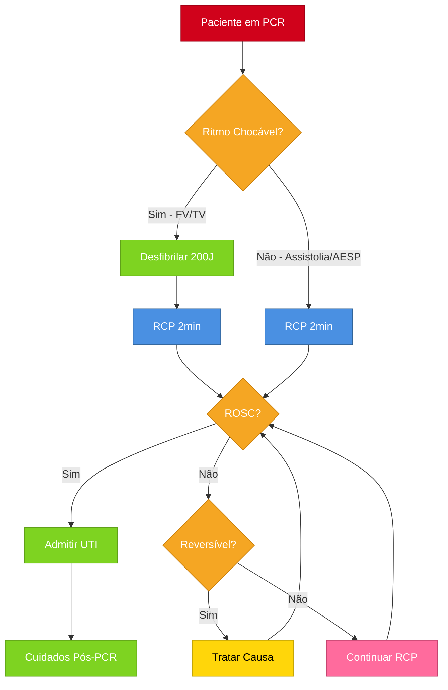
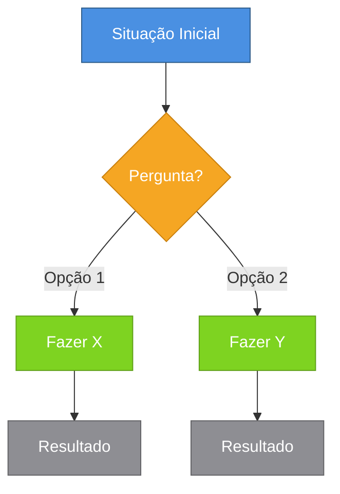
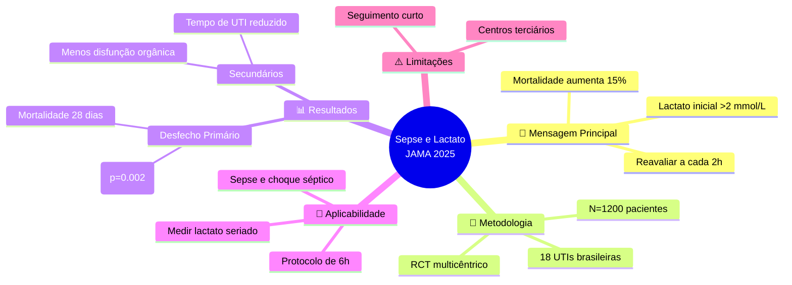
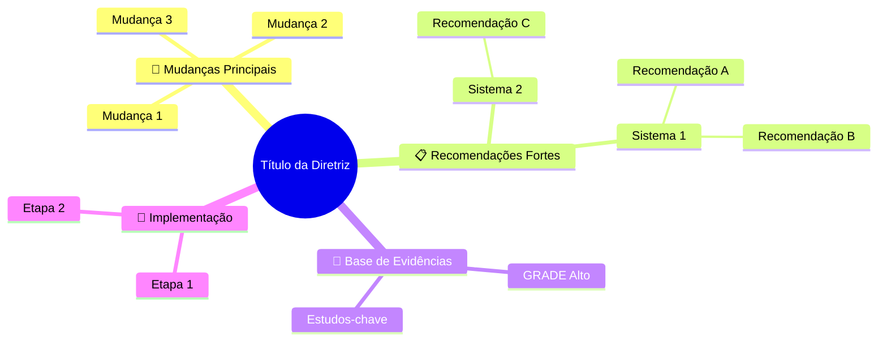
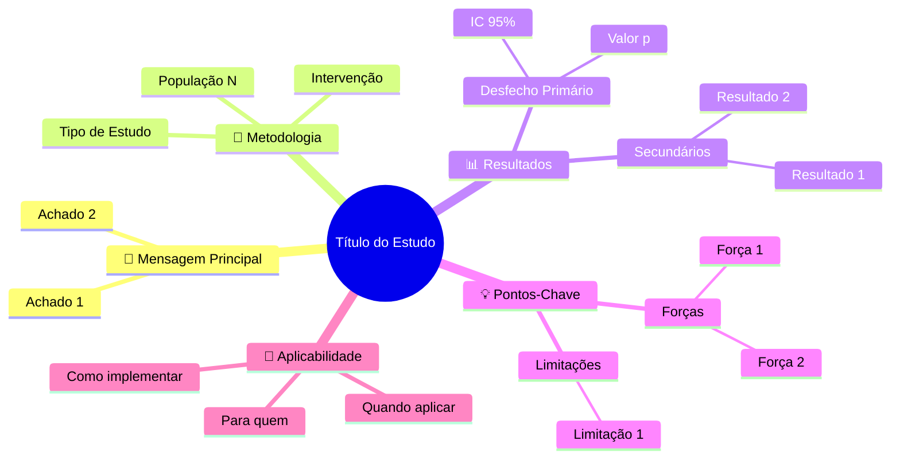
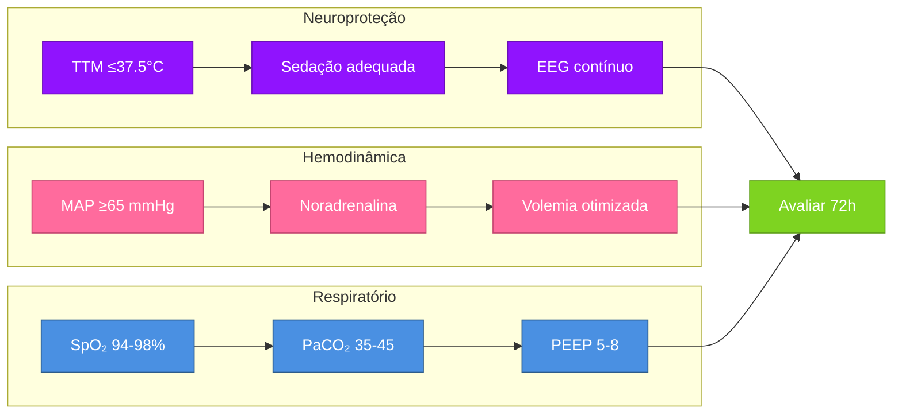

# Padrões Mermaid para Visualizações

## Cores Padronizadas

### Paleta de Cores (Copie e cole)
```
Azul (Início/Info): fill:#4A90E2,stroke:#2E5C8A,color:#fff
Laranja (Decisão): fill:#F5A623,stroke:#C87E0A,color:#fff
Verde (Ação Positiva): fill:#7ED321,stroke:#5FA019,color:#fff
Vermelho (Alerta/Urgente): fill:#D0021B,stroke:#9A0115,color:#fff
Roxo (Neurológico): fill:#9013FE,stroke:#6B0FB8,color:#fff
Rosa (Hemodinâmica): fill:#FF6B9D,stroke:#C44570,color:#fff
Cinza (Fim/Observação): fill:#8E8E93,stroke:#636366,color:#fff
Amarelo (Atenção): fill:#FFD60A,stroke:#C4A508,color:#000
```

## 1. Fluxograma Clínico (Flowchart)

### Exemplo: Manejo de PCR


### Estrutura Base


## 2. Mapa Mental (OBRIGATÓRIO ao final)

### Exemplo: Resumo de Estudo sobre Sepse


### Estrutura Base para Diretrizes


### Estrutura Base para Estudos


## 3. Protocolo por Sistemas

### Exemplo: Protocolo Pós-PCR


## 4. Timeline de Intervenções

### Exemplo: Protocolo de Sepse

```mermaid
gantt
    title Protocolo de Sepse (Primeira Hora)
    dateFormat HH:mm
    axisFormat %H:%M
    
    section Diagnóstico
    Lactato sérico           :done, 00:00, 5m
    Hemoculturas (2 sets)    :done, 00:05, 10m
    
    section Intervenção
    Antibiótico empírico     :crit, 00:15, 15m
    Reposição volêmica       :active, 00:30, 30m
    
    section Monitorização
    Reavaliação lactato      :00:55, 5m
```


## Quando Usar Cada Tipo

**Flowchart:** Algoritmos clínicos, protocolos de decisão, processos sequenciais
**Mindmap:** SEMPRE ao final de CADA resumo (obrigatório)
**Subgraphs:** Protocolos multi-sistema (cardio, neuro, respiratório)
**Timeline (Gantt):** Protocolos com timing específico (primeira hora, primeiras 6h)

## Regras de Estilo

1. **Use losangos `{}` para decisões** - sempre laranja
2. **Use retângulos `[]` para ações** - verde se positiva, azul se neutra
3. **Use cores por sistema:**
   - 🧠 Neurológico: Roxo
   - 💓 Hemodinâmica: Rosa
   - 🫁 Respiratório: Azul
   - ⚠️ Urgente/Crítico: Vermelho
   - ✅ Sucesso/Fim positivo: Verde
   - 🔍 Observação/Fim neutro: Cinza

4. **Sempre use style no final** para aplicar cores

## Dica: Teste Rápido
Cole no visualizador: https://mermaid.live/
